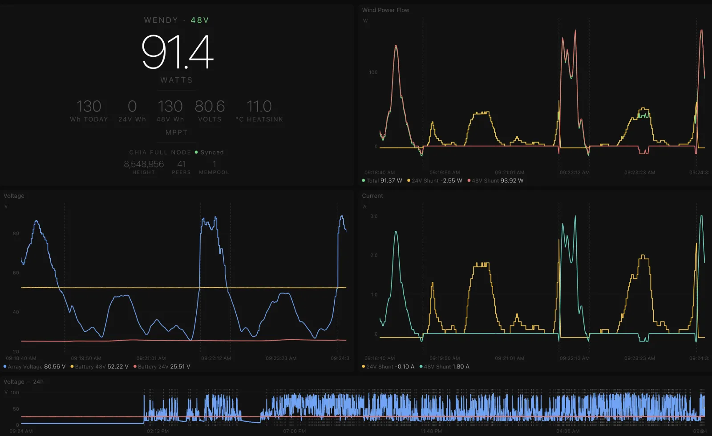

# Wendy

Dashboard for a wind and solar hybrid energy system. An experimental twin axial flux wind turbine with dual battery banks (24V/48V) and solar panels power a Chia blockchain full node running on a Raspberry Pi 5.



The Chia node (Raspberry Pi 5) and a mobile router are powered via a [Linovision 5-port PoE switch](https://global.linovision.com/collections/poe-switches/products/5-ports-dc9-54v-input-full-gigabit-poe-switch-with-voltage-booster) with dual 24V/48V redundant input — 24V primary to use all wind yield directly without going through the battery. Wendy replaces Home Assistant with a focused, real-time monitoring interface for the energy system and optionally the Chia node status.

Collects data from [Victron Energy](https://www.victronenergy.com/) and [Morningstar](https://www.morningstarcorp.com/) hardware via Modbus TCP, stores 24h of history in SQLite, and serves a live dashboard via [Deno Fresh](https://fresh.deno.dev/). Includes a transparent overlay mode (`/overlay`) for compositing real-time stats and charts over a live video stream using headless Chrome and ffmpeg. Supports split deployment: the Pi collects hardware data and forwards it over WebSocket to a VPS that runs the dashboard.

## The Turbine

Wendy uses two identical axial flux generators that can be switched between parallel (24V) and series (48V) configuration based on wind conditions. The system has three data sources, all polled via Modbus TCP at 1-second intervals:

- **Morningstar TriStar MPPT 600V** (48V charge controller) — array voltage, battery voltage, current, temperature, charge state. Registers use IEEE 754 half-precision (float16) encoding.
- **Victron Wind Control BMV-700** (24V shunt) — voltage, current, power, charged energy. Polled via Victron GX Modbus TCP gateway (unit 239, `com.victronenergy.battery`).
- **Victron Wind Turbine SmartShunt** (48V shunt) — voltage, current, power, produced energy. Polled via GX gateway (unit 223, `com.victronenergy.dcsource`).

MQTT is used only for the GX keepalive (keeps the GX publishing data for Modbus reads).

## Dashboard

Single-page 2x2 grid layout fitting one viewport:

```
┌──────────────┬──────────────┐
│  Hero stats  │  Power chart │
│  (watts, V,  │  (total,     │
│   kWh, temp) │   24V, 48V)  │
├──────────────┼──────────────┤
│  Voltage     │  Current     │
│  (array,     │  (24V shunt, │
│   bat 48/24) │   48V shunt) │
├──────────────┴──────────────┤
│  Voltage — 24h history      │
└─────────────────────────────┘
```

- Real-time streaming charts (canvas, 10-minute window, 1s resolution)
- 24h voltage history chart at the bottom
- Live SSE updates for all values
- Dynamic Y-axis scaling
- Light/dark theme (follows system preference, overridable)
- 24V/48V mode detection with hysteresis

### Stream Overlay (`/overlay`)

A dedicated page for compositing over a live video stream (headless Chrome + ffmpeg). Transparent background, semi-transparent dark panels, large fonts, thick chart lines.

```
┌─────────────────┬─────────────────┐
│                 │  WENDY · 24V    │
│  (transparent)  │  1,247 W        │
│  video shows    │  52.4V / 54.1V  │
│  through        │  0.42 kWh today │
│                 │  34°C · mppt    │
├─────────────────┼─────────────────┤
│  Voltage chart  │  Power chart    │
│  (array, 48V,   │  (total, 24V,   │
│   24V battery)  │   48V output)   │
└─────────────────┴─────────────────┘
```

- Transparent background for headless Chrome compositing
- 3px chart lines, 14-16px fonts for video readability
- Semi-transparent dark panels (`rgba(0,0,0,0.6)`)
- No interactive elements

## Architecture

The system can run in three modes controlled by `WENDY_ROLE`:

### Standalone (default)

Everything in one process — the original all-in-one mode for running on the Pi:

```
              Docker Container
┌────────────────────────────────────────────┐
│  ┌──────────┐  ┌──────────┐  ┌─────────┐  │
│  │ TriStar  │  │ Victron  │  │  Fresh   │  │
│  │ Modbus   │  │ GX Modbus│  │  Server  │  │
│  └────┬─────┘  └────┬─────┘  └────┬─────┘  │
│       └──────┬───────┘             │        │
│              ▼                     │        │
│  ┌───────────────────┐             │        │
│  │   DataBus         │─── SSE ────►│        │
│  │  (event hub +     │             │        │
│  │   ring buffer)    │             │        │
│  └────────┬──────────┘             │        │
│           ▼                        │        │
│  ┌───────────────────┐             │        │
│  │   SQLite          │◄─── REST ───┘        │
│  └───────────────────┘                      │
│  ┌──────────┐                              │
│  │  MQTT    │  GX keepalive                 │
│  └──────────┘                              │
└────────────────────────────────────────────┘
```

### Split: Source (Pi) + Display (VPS)

The Pi collects hardware data and forwards it over WebSocket to the VPS, which runs the dashboard:

```
Pi (source)                         VPS (display)
┌─────────────────────┐             ┌─────────────────────────────┐
│  TriStar Modbus     │             │  /api/ingest (WebSocket)    │
│  Victron Modbus     │── Reading ─►│         │                   │
│  Victron MQTT       │   over WS   │         ▼                   │
│         │           │             │     DataBus                 │
│         ▼           │             │     ├── SSE → clients       │
│     DataBus         │             │     ├── flush → SQLite      │
│         │           │             │     └── ring buffer         │
│         ▼           │             │                             │
│     ws-client ──────┼─────────────┼──►  Fresh server            │
│  (bearer token)     │   HTTPS/WS  │     (dashboard, REST API)   │
└─────────────────────┘             └─────────────────────────────┘
```

**DataBus** is the central event hub. Pollers push readings into it. It detects 24V/48V mode from the array voltage (hysteresis at 48V/52V thresholds), maintains a 10-minute ring buffer for chart preloading, broadcasts merged state to SSE subscribers, and buffers samples for batched SQLite writes every 5 seconds.

## Deployment

### Standalone (single machine)

```bash
git clone git@github.com:janit/wendy.git
cd wendy
cp .env.example .env
./scripts/deploy.sh
```

The deploy script builds the Docker image, runs a smoke test, deploys with `--network host` for LAN access, and prunes old images/containers. SQLite data persists in `./data/`.

### Split (Pi + VPS)

Generate a shared secret and set it on both sides:

```bash
openssl rand -hex 32
```

**Pi** (data source):

```bash
# .env
WENDY_ROLE=source
WENDY_UPSTREAM=ws://your-vps:8086/api/ingest
WENDY_SECRET=your-shared-secret
WENDY_MQTT_HOST=192.168.47.6
WENDY_MODBUS_HOST=192.168.47.11
WENDY_GX_HOST=192.168.47.6
```

```bash
./scripts/deploy.sh   # needs --network host for Modbus/MQTT
```

**VPS** (dashboard):

```bash
# .env
WENDY_ROLE=display
WENDY_PORT=8086
WENDY_SECRET=your-shared-secret
```

```bash
./scripts/deploy.sh
```

No `--network host` needed on the VPS. A `Caddyfile.example` is included for putting Caddy in front of the dashboard. The Pi connects directly to port 8086 with a bearer token — use a VPN, firewall rules, or Caddy with TLS to secure the connection in transit.

### Configuration

All config via environment variables (see `.env.example`):

| Variable | Default | Description |
|----------|---------|-------------|
| `WENDY_ROLE` | `standalone` | `source`, `display`, or `standalone` |
| `WENDY_UPSTREAM` | — | WebSocket URL for source mode (e.g. `ws://your-vps:8086/api/ingest`) |
| `WENDY_SECRET` | — | Shared secret for WebSocket auth (must match on source + display) |
| `WENDY_MQTT_HOST` | `192.168.47.6` | Victron GX MQTT broker (source/standalone) |
| `WENDY_MQTT_PORT` | `1883` | MQTT port |
| `WENDY_MODBUS_HOST` | `192.168.47.11` | TriStar 600V Modbus TCP (source/standalone) |
| `WENDY_MODBUS_PORT` | `502` | Modbus port |
| `WENDY_GX_HOST` | `192.168.47.6` | Victron GX Modbus TCP (source/standalone) |
| `WENDY_GX_MODBUS_PORT` | `502` | GX Modbus port |
| `WENDY_DB_PATH` | `./data/wendy.db` | SQLite database path (display/standalone) |
| `WENDY_PORT` | `8086` | HTTP server port (display/standalone) |

## Development

```bash
deno task dev       # Vite dev server with HMR
deno task build     # Build for production
deno task serve     # Production server with data collection
deno task test      # Run tests
```

## Project Structure

```
wendy/
├── main.ts                    # Fresh app export (Vite entry)
├── serve.ts                   # Production entry: boot + serve built app
├── lib/
│   ├── boot.ts                # Startup: role-based init (source/display/standalone)
│   ├── databus.ts             # Event hub, mode detection, ring buffer, SSE broadcast
│   ├── modbus.ts              # TriStar MPPT 600V Modbus TCP poller
│   ├── victron-modbus.ts      # Victron GX Modbus TCP (24V + 48V shunts)
│   ├── mqtt.ts                # Victron MQTT (GX keepalive only)
│   ├── ws-client.ts           # WebSocket client (source mode → upstream VPS)
│   ├── types.ts               # Wire types for WebSocket messages
│   ├── db.ts                  # SQLite schema, batched writes, queries
│   ├── float16.ts             # IEEE 754 half-precision decoder
│   └── state.ts               # Shared state (globalThis bridge for bundled routes)
├── routes/
│   ├── index.tsx               # Dashboard (2x2 grid + 24h chart)
│   ├── overlay.tsx             # Stream overlay (transparent, for video compositing)
│   └── api/
│       ├── events.ts           # SSE stream of live merged readings
│       ├── ingest.ts           # WebSocket endpoint (display mode, receives from Pi)
│       ├── recent.ts           # Ring buffer (last 10 min) for chart preload
│       ├── history.ts          # 24h samples from SQLite
│       ├── stats.ts            # Daily aggregates
│       └── health.ts           # Health check (includes version hash)
├── islands/
│   ├── StreamingCharts.tsx     # Canvas charts (power, voltage, current, 24h)
│   ├── OverlayCharts.tsx       # Overlay charts (voltage + power, thick lines)
│   └── ThemeToggle.tsx         # Light/dark switch
└── scripts/
    ├── deploy.sh               # Build, smoke test, deploy, prune
    └── scan-modbus.py          # Diagnostic: scan GX Modbus unit IDs
```
